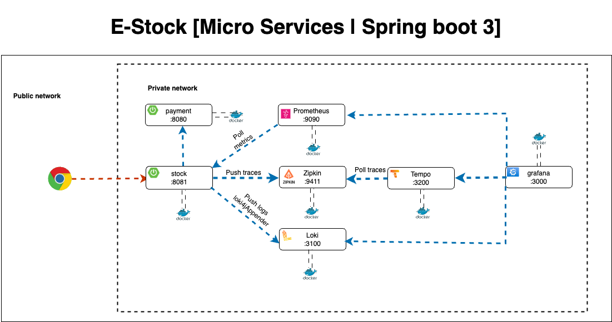

# spring boot grafana prometheus

## Overview

spring boot grafana prometheus is an application that enables users to sale products and manage their sales. The application is divided into two main services: Stock and payment. The Stock service is responsible for managing products and their stock levels, while the payment service is responsible for processing payments. The application also includes a frontend to manages logs and metrics.

#### Backend services

### Backend (Technologies)

- Spring Boot 3
- Spring Data JPA
- Docker
- Docker-compose
